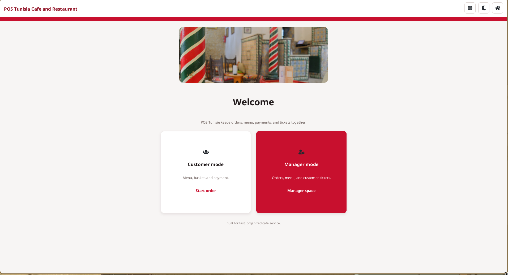
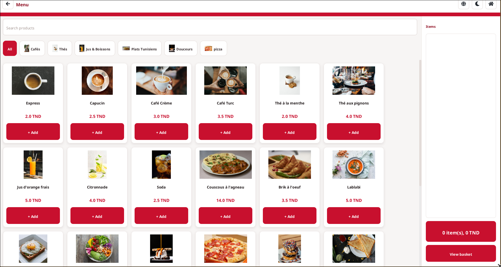
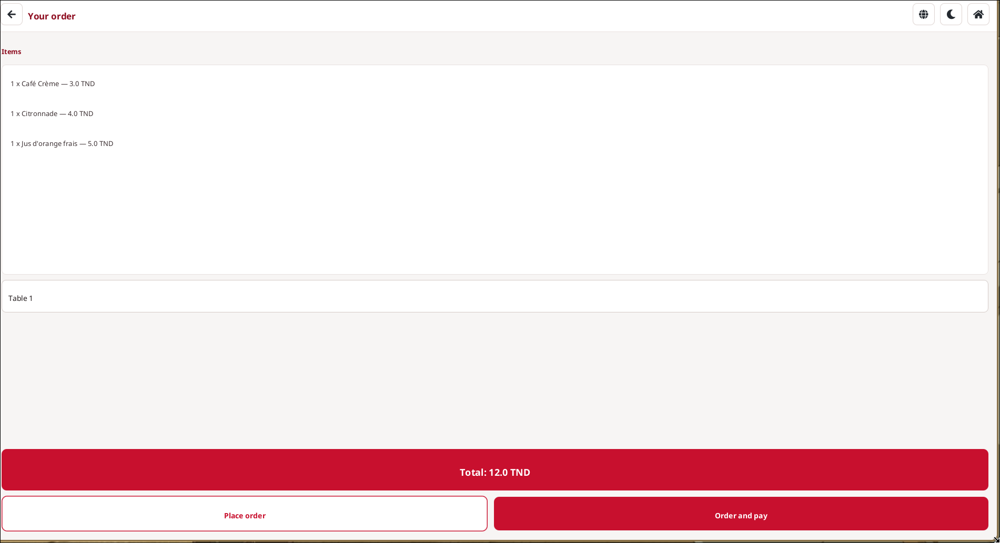
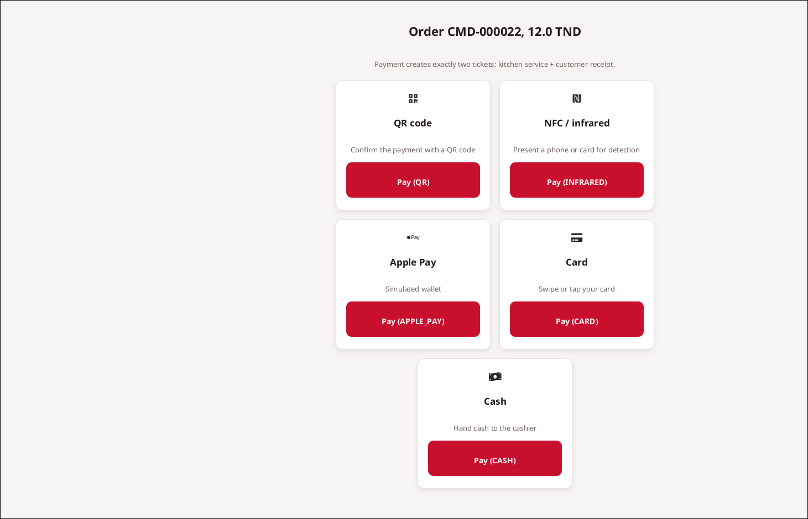
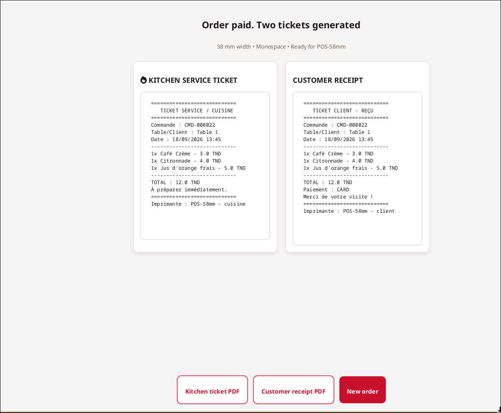
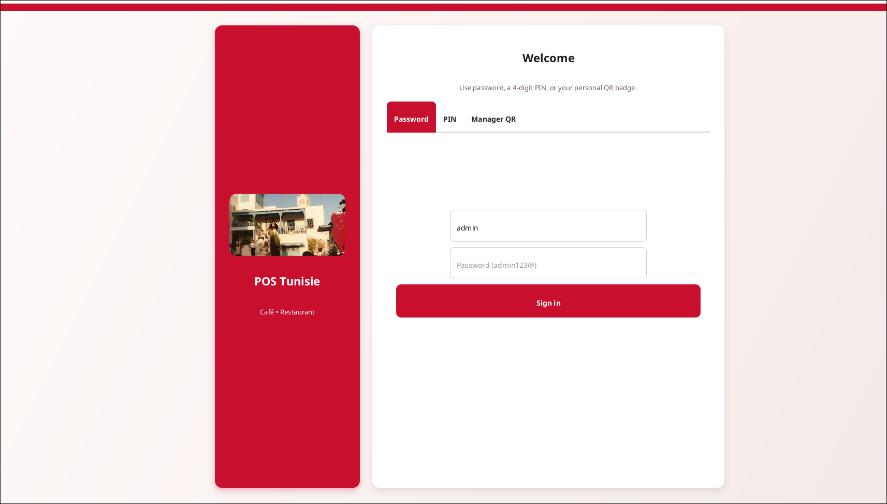
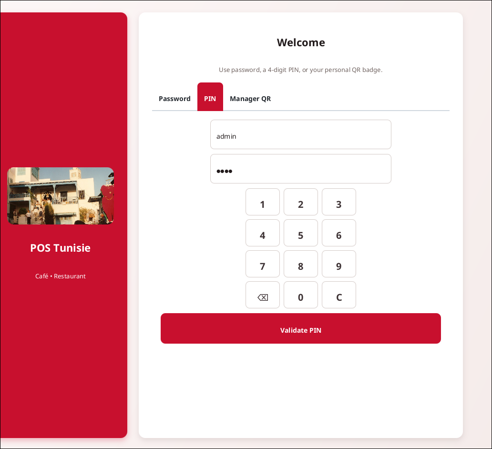
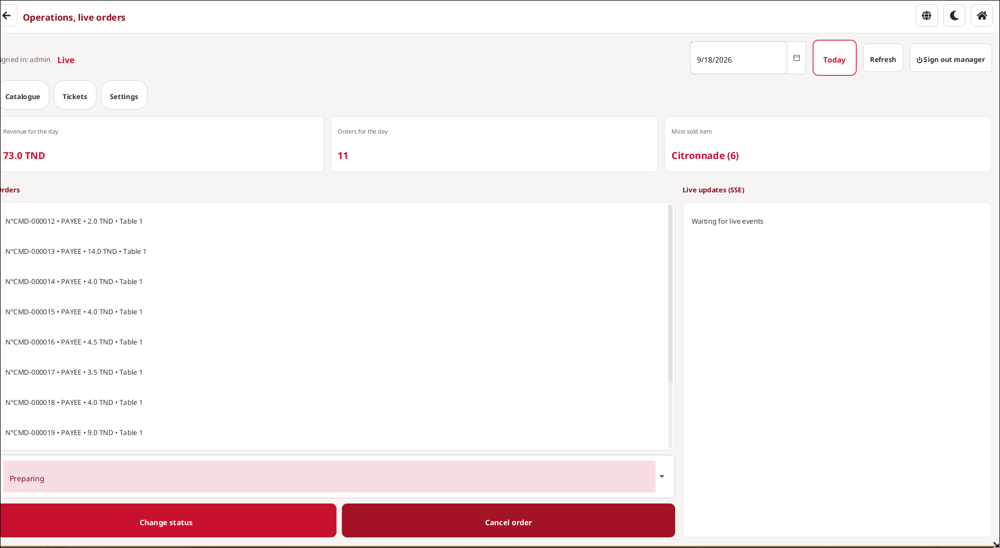
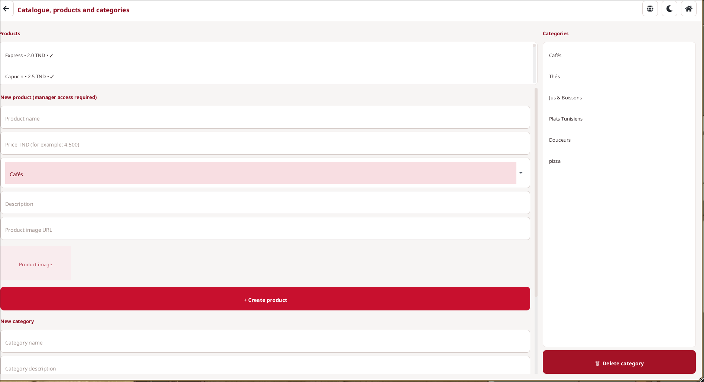
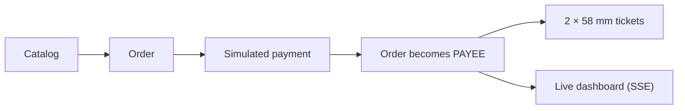

# 🇹🇳 POS Tunisie — Café & Restaurant

> A point-of-sale platform for Tunisian cafés and restaurants: fast order taking, simulated payment, kitchen-ready tickets, and real-time order visibility.

<p align="center">
  
  <br />
  
</p>

> [!WARNING]
> **Demo version, not for production use.** This is a functional demonstration.
> Payments are **100% simulated**: no real payment gateway is connected.
> Default credentials, local setup and simulated data are for **evaluation only**.
> Commercial use requires written permission (see [License](#license-and-commercial-use)).

**Latest release:** see [Releases](../../releases) for installers and the changelog.

---

## Contents

- [Product at a glance](#product-at-a-glance)
- [How it works](#how-it-works)
- [Features](#features)
- [Quick start](#quick-start)
- [Default demo credentials](#default-demo-credentials)
- [Architecture](#architecture)
- [API reference](#api-reference)
- [Testing](#testing)
- [License and commercial use](#license-and-commercial-use)

---

## Product at a glance

| | |
| --- | --- |
| <br/>**Home screen** | <br/>**Customer menu and basket** |
| <br/>**Order basket** | <br/>**Payment methods** |
| <br/>**Kitchen and customer tickets** | <br/>**Manager login (password)** |
| <br/>**Manager login (PIN)** | <br/>**Manager dashboard** |
| <br/>**Catalog administration** | |

### Project snapshot

| Item | Current state |
| --- | --- |
| Product scope | Café and restaurant point of sale |
| Primary users | Manager, cashier, kitchen/service team, customer |
| Delivery status | Backend API and JavaFX desktop client implemented and tested |
| Language | French-oriented workflows and Tunisia-specific configuration |
| Payments | Fully simulated, no real payment gateway |

---

## How it works

POS Tunisie gives an establishment one operational flow from catalog to receipt.



1. The team manages categories and available products.
2. A cashier creates an order using a price and product-name snapshot.
3. Payment is confirmed through a simulated method.
4. The order becomes `PAYEE` and the system automatically produces exactly two 58 mm tickets: one for service/kitchen and one customer receipt.
5. Connected screens receive order updates in real time through Server-Sent Events (SSE).

---

## Features

### Business capabilities

| Capability | What it supports |
| --- | --- |
| Catalog management | Categories, products, prices, availability, and product photos |
| Order management | Create, view, update status, and cancel orders |
| Authentication | Manager sign-in by password, PIN, or QR key; JWT-protected management actions |
| Payments | Simulated cash, card, QR, Apple Pay, infrared/NFC proximity, and other configured methods |
| Tickets | Kitchen/service ticket plus customer receipt after payment |
| Real-time operations | Live order notifications over SSE |
| API documentation | Interactive Swagger/OpenAPI documentation |

### Desktop application (`desktop-pos/`)

The JavaFX client covers customer self-service and manager operations. It talks to the Spring Boot API over REST and receives live updates through SSE.

- **Customer mode:** browse the catalog, add items with per-product quantity steppers, review the basket, and confirm a simulated payment (cash, card, QR, NFC/proximity, or configured digital methods).
- **Manager mode:** sign in with a password, PIN, or manager QR badge; monitor live orders; manage categories, products and photos; review tickets; change application settings.
- **Dashboard:** day revenue and top sellers count **paid orders only**, with a total vs paid counter and a top-3 best-sellers list.
- **Interface:** English and French-oriented labels, light/dark themes, responsive layouts, Tunisian café imagery, QR support, and 58 mm ticket previews.

### Backend (`backend-pos/`)

- Spring Boot API following Clean Architecture
- MongoDB persistence adapters
- JWT authentication with a seeded manager account
- Simulated payment confirmation and 58 mm ticket rendering
- SSE order-notification stream
- Catalog image upload (manager only)
- Swagger UI and a Docker build definition

---

## Quick start

### Option 1: Desktop installer (easiest)

Download the installer for your platform from the [Releases](../../releases) page:

| Platform | Installer |
| --- | --- |
| Linux | `.deb` |
| Windows | `.exe` |
| macOS | `.dmg` |

The installer is self-contained: it bundles the JavaFX client, the Spring Boot API and a local MongoDB server. On launch it:

1. starts MongoDB with a persistent data directory at `~/.pos-tunisie/mongodb-data`,
2. starts the API on `127.0.0.1:18080`,
3. opens the desktop client.

Your Atlas URI and repository `.env` are never included in the installer.

<details>
<summary><strong>Building the installers yourself</strong></summary>

GitHub Actions builds the native installers. Open the **Build POS installers** workflow and choose **Run workflow**. For a permanent download, push a version tag such as `v1.1.0`: the workflow attaches all three installers to the GitHub release. Each installer is also kept as a downloadable workflow artifact.

</details>

### Option 2: Run from source

**Prerequisites**

- JDK 26
- A MongoDB instance reachable by the backend (only needed to run the app, not the tests)

**Setup**

```bash
cp backend-pos/.env.example backend-pos/.env
# Edit backend-pos/.env: set MONGODB_URI and JWT_SECRET
```

**Run backend and desktop client together** (from the repository root):

```bash
./run-all.sh
```

**Or run them separately:**

```bash
# Terminal 1: backend
cd backend-pos
./mvnw spring-boot:run

# Terminal 2: desktop client
cd desktop-pos
./mvnw javafx:run -Dpos.apiBase=http://localhost:8080/api/v1
```

Environment variables are loaded from `backend-pos/.env` by the application startup support. Do not commit that file.

### Option 3: Docker (backend only)

```bash
cd backend-pos
docker build --network=host -t pos-backend .
docker run --network=host \
  -e MONGODB_URI=mongodb://localhost:27017/pos_tunisie \
  pos-backend
```

---

## Default demo credentials

| Method | Default |
| --- | --- |
| Username / password | `admin` / `admin123@` |
| PIN | `1234` |
| QR key | Set `ADMIN_QR_KEY`; a key is generated if the default placeholder is left in place |

> [!CAUTION]
> Change all default credentials and the JWT secret before any shared or production deployment. Never commit `backend-pos/.env`.

---

## Architecture

| Layer | Technology / approach |
| --- | --- |
| Runtime | Java 26 |
| Backend | Spring Boot 4.1.1 (Spring MVC) |
| Desktop client | JavaFX |
| Database | MongoDB / MongoDB Atlas |
| Security | JWT with password, PIN, and QR login options |
| Documentation | springdoc OpenAPI / Swagger UI |
| Real-time | Server-Sent Events |
| Structure | Clean Architecture: `domain` → `application` → `infrastructure` → `presentation` |
| Packaging | Docker (backend), native installers (desktop) |

### Repository structure

```text
backend-pos/         Spring Boot API
desktop-pos/         JavaFX desktop client
  assets/            Tunisian cuisine and café reference imagery
docs/screenshots/    Live desktop application screenshots
run-all.sh           Starts backend and desktop client together
LICENSE              Custom non-commercial license
```

---

## API reference

Once the backend is running:

| Resource | Address |
| --- | --- |
| Swagger UI | `http://localhost:8080/swagger-ui.html` |
| OpenAPI JSON | `http://localhost:8080/api-docs` |
| API base path | `http://localhost:8080/api/v1` |
| Live notifications | `GET /api/v1/notifications/stream` |

### Endpoints

All paths are relative to `/api/v1`.

| Area | Endpoints |
| --- | --- |
| Authentication | `POST /auth/login`, `/auth/pin`, `/auth/qr` |
| Categories | `GET/POST /categories`, `GET/PUT/DELETE /categories/{id}`, `GET /categories/actives` |
| Products | `GET/POST /products`, `GET/PUT/DELETE /products/{id}`, `PATCH /products/{id}/disponibilite` |
| Images | `POST /images` (manager only; jpg, png, webp, gif; 5 MB max) |
| Orders | `POST/GET /orders`, `GET /orders/{id}`, `PATCH /orders/{id}/statut`, `POST /orders/{id}/annuler` |
| Payments (simulated) | `POST /payments/confirmer`, `POST /payments/proximite`, `GET /payments` |
| Tickets | `GET /tickets`, `GET /tickets/{id}` |

### Access rules

- **Public:** catalog reads, order creation, payment endpoints, authentication, live notifications, API documentation, and uploaded catalog images.
- **Manager only (bearer JWT):** all management writes, including image upload.

---

## Testing

The backend unit tests mock MongoDB and do not need a running database. The desktop tests use headless JavaFX smoke checks and do not need a display.

```bash
# Backend
cd backend-pos
./mvnw test

# Desktop
cd desktop-pos
./mvnw test
```

Desktop coverage includes UI parsing, headless UI smoke tests, Arabic layout safety, QR/proximity behavior, and localization/text safety (19 tests at last verification).

---

## License and commercial use

> [!IMPORTANT]
> Payments are deliberately simulated. This project must not be connected to a real payment gateway without a separate, security-reviewed payment integration scope.

This project is released under the custom [Non-Commercial License](LICENSE). You may copy, study, modify, and use the software for personal, educational, or non-commercial purposes.

**Commercial use, resale, sublicensing, paid hosting, and incorporating the software into a paid product are not permitted without written permission** from the rights holder, **Mohamed Amine Ammar**.

Need POS Tunisie for your business? Contact the author through this repository to commission a **production version**, including security hardening, real payment integration, deployment and support.
