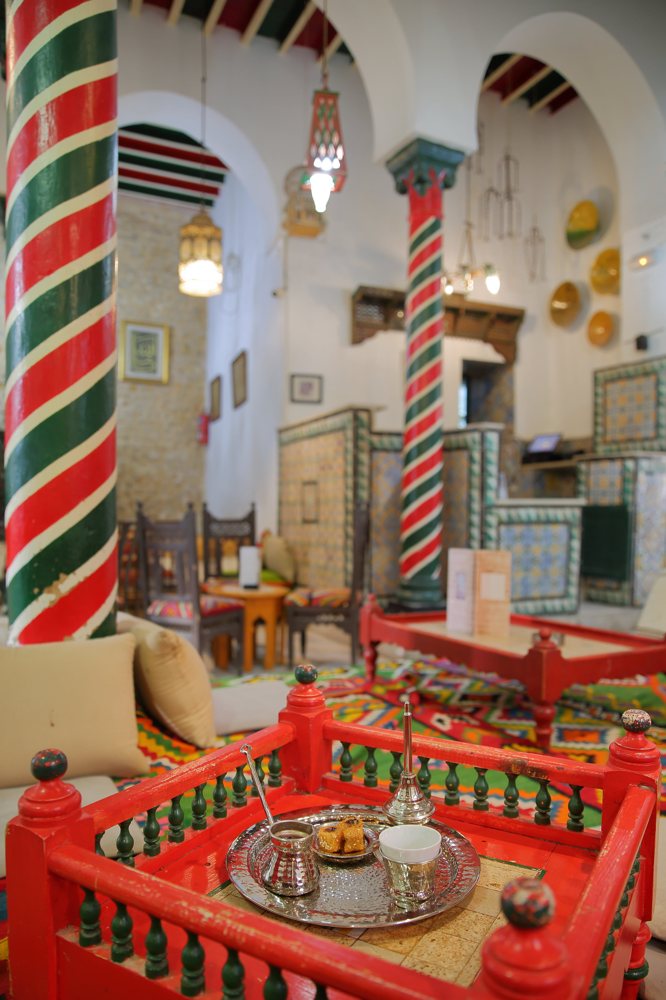

# 🇹🇳 POS Tunisie — Café & Restaurant

> A point-of-sale platform designed for Tunisian cafés and restaurants: fast order taking, simulated payment, kitchen-ready tickets, and real-time order visibility.



## Project snapshot

| Item | Current state |
| --- | --- |
| Product scope | Café and restaurant point of sale |
| Primary users | Manager, cashier, kitchen/service team, customer |
| Delivery status | Backend API implemented and unit-tested; desktop interface is the next milestone |
| Language | French-oriented workflows and Tunisia-specific configuration |
| Payments | Fully simulated — no real payment gateway is connected |

## Why this product

POS Tunisie gives an establishment one operational flow from catalog to receipt:

1. The team manages categories and available products.
2. A cashier creates an order using a price and product-name snapshot.
3. Payment is confirmed through a simulated method.
4. The order becomes `PAYEE` and the system automatically produces exactly two 58 mm tickets: one for service/kitchen and one customer receipt.
5. Connected screens receive order updates in real time through Server-Sent Events (SSE).

## Business capabilities

| Capability | What it supports |
| --- | --- |
| Catalog management | Categories, products, prices, and availability |
| Order management | Create, view, update status, and cancel orders |
| Authentication | Manager sign-in by password, PIN, or QR key; JWT-protected management actions |
| Payments | Simulated cash, card, QR, Apple Pay, infrared proximity, and other configured methods |
| Tickets | Kitchen/service ticket plus customer receipt after payment |
| Real-time operations | Live order notifications over SSE |
| API documentation | Interactive Swagger/OpenAPI documentation |


## Delivery scope

### Available now

- Spring Boot backend API following Clean Architecture
- MongoDB persistence adapters
- JWT authentication and manager seed account
- Simulated payment confirmation and 58 mm ticket rendering
- SSE order-notification stream
- Swagger UI and Docker build definition
- Unit-test suite that runs without a database

### Next milestone

The `desktop-pos/` area is reserved for the JavaFX desktop application. Its initial assets are available in `desktop-pos/assets/`; no desktop application has been scaffolded yet.

## Technical foundation

| Layer | Technology / approach |
| --- | --- |
| Runtime | Java 26 |
| Backend | Spring Boot 4.1.1 (Spring MVC) |
| Database | MongoDB / MongoDB Atlas |
| Security | JWT with password, PIN, and QR login options |
| Documentation | springdoc OpenAPI / Swagger UI |
| Real-time | Server-Sent Events |
| Architecture | Clean Architecture: `domain` → `application` → `infrastructure` → `presentation` |
| Packaging | Docker |

## Repository structure

```text
backend-pos/     Spring Boot API
desktop-pos/     Reserved JavaFX desktop client
  assets/        Tunisian cuisine and café reference imagery for the future UI
```

## Run locally

### Prerequisites

- JDK 26
- MongoDB instance reachable by the backend (required only to run the application)
- Docker, if using the container option

### Setup and test

```bash
cp backend-pos/.env.example backend-pos/.env
# Update MONGODB_URI and JWT_SECRET in backend-pos/.env

cd backend-pos
./mvnw test
./mvnw spring-boot:run
```

The unit tests mock MongoDB and therefore do not require a running database. Environment files are not loaded automatically by Spring; export their values in your shell or pass them as Spring properties when launching the application.

### Run with Docker

```bash
cd backend-pos
docker build --network=host -t pos-backend .
docker run --network=host \
  -e MONGODB_URI=mongodb://localhost:27017/pos_tunisie \
  pos-backend
```

## API access

Once the application is running:

| Resource | Address |
| --- | --- |
| Swagger UI | `http://localhost:8080/swagger-ui.html` |
| OpenAPI JSON | `http://localhost:8080/api-docs` |
| API base path | `http://localhost:8080/api/v1` |
| Live notifications | `GET /api/v1/notifications/stream` |

### API map

| Area | Endpoints |
| --- | --- |
| Authentication | `POST /auth/login`, `/auth/pin`, `/auth/qr` |
| Categories | `GET/POST /categories`, `GET/PUT/DELETE /categories/{id}`, `GET /categories/actives` |
| Products | `GET/POST /products`, `GET/PUT/DELETE /products/{id}`, `PATCH /products/{id}/disponibilite` |
| Orders | `POST/GET /orders`, `GET /orders/{id}`, `PATCH /orders/{id}/statut`, `POST /orders/{id}/annuler` |
| Payments (simulated) | `POST /payments/confirmer`, `POST /payments/proximite`, `GET /payments` |
| Tickets | `GET /tickets`, `GET /tickets/{id}` |

All paths in the table above are relative to `/api/v1`. Catalog reads, order creation, payment endpoints, authentication, live notifications, and API documentation are publicly available. Management writes require a bearer JWT.

## Demo manager account

| Method | Default |
| --- | --- |
| Username / password | `admin` / `admin123@` |
| PIN | `1234` |
| QR key | Configure `ADMIN_QR_KEY`; a key is generated when the default placeholder remains |

Change all default credentials and the JWT secret before any shared or production deployment. Do not commit `backend-pos/.env`.

## Visual asset sources

The future desktop UI includes downloaded visual references, retained with their source pages for licence review before production use:

- `desktop-pos/assets/tunisian-couscous.jpg` — [Kids World Travel Guide / Tunisia](https://www.kids-world-travel-guide.com/tunisia.html)
- `desktop-pos/assets/tunisian-cafe.jpg` — [Journal du Net / Tunis](https://www.journaldunet.com/management/vie-personnelle/1507171-20-destinations-pour-un-week-end-prolonge/1507211-tunis)

## Important implementation note

Payments are deliberately simulated. This project must not be connected to a real payment gateway without a separate, security-reviewed payment integration scope.
